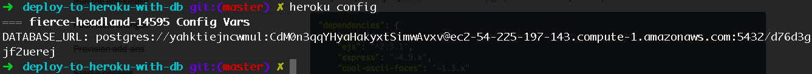

## Deploying to Heroku with PSQL

This walkthrough assumes that you unders how make a simple express APP with a single route. This app has db base called usersTest with one table for users. The users table has two coloumns, name and id. 

If you need a head start when it comes to creating an express app, check [this](https://github.com/HalahRaadSalih/g16-project-settings) repo to get you started.


 Make sure you're loggedn to your heroku account first. 
 
 
### Steps
 
 - Create a heroko app using the following command:
 	
 	```
 		$ 	heroku create
 		
 	```

- Deoply your app using the following command:

	```
		$ 	git push heroku master

	```
	
- To display the log for heroky, you have this command:
	
	```
		$  heroku logs --tail

	```

<br>	
But, wait .. what about the database mentioned?

The data base you create on your laptop, in in fact on your laptop, heroku doesn't know a thing about it, it doessn't know a thing about it, because that database is for developement environment and it strictly for development and Heroku's enviroment is for production. What does that mean? It means we need to head to our knexfile.js and head to the production objection and fix/add something there. Here is the current production object:

```
	production: {
    client: 'postgresql',
    connection: {
      database: 'my_db',
      user:     'username',
      password: 'password'
    }
```	

We need to have a production enviroment database that we can reference to in production connection database key. How do we get to create db with our heroku app? here is how:

```
	$ heroku addons:create heroku-postgresql:hobby-dev
	
```

This creates a database for your app. But how do I access this database? Type this command:

```
	$ heroku config
	
```

you 'll get something similar: 
<br>



see that DATABASE_URL? that's a link to your production environment that was create for by heroku after the previous command. Copy that URL and head to your `knexfile.js`, to production object and paste the url to database connection key.

Make sure you push your changes to your master, then deploy the changes to herou like you did before. Open your heroku app.

- To create run the migrations that you have created, you need to run them for heroku using the command:

	```
		$ heroku run knex migrate:latest
		
	```